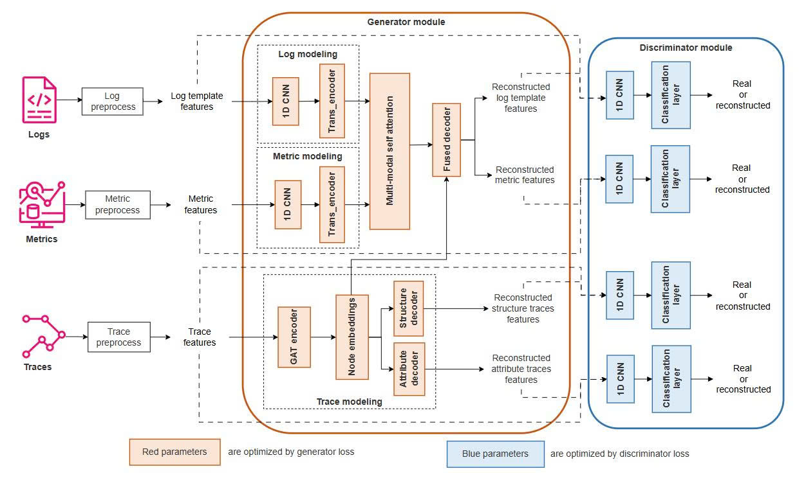

<h1 align="center">UAC-AD</h1>

<p align="center">
  <b>Unsupervised Adversarial Contrastive Learning for Anomaly Detection on Multi-source Data</b>
</p>

<p align="center">
  
  
  
  
  
</p>

<p align="center">
  UAC-AD detects anomalies in cloud/microservice systems by jointly learning from three data modalities — <b>KPI metrics</b>, <b>logs</b>, and <b>traces</b> — without requiring labeled training data.
</p>

---

## Table of Contents

- [Key Features](#key-features)
- [Architecture Overview](#architecture-overview)
- [Getting Started](#getting-started)
- [Datasets](#datasets)
- [Running Experiments](#running-experiments)
- [Key Arguments](#key-arguments)
- [Results](#results)
- [Project Structure](#project-structure)
- [Documentation](#documentation)
- [Citation](#citation)

---

## Key Features

- **Unsupervised** — trains exclusively on normal data; no anomaly labels required
- **Multi-modal fusion** — jointly learns from KPI metrics, logs, and service traces via multi-modal self-attention
- **Residual-gated trace fusion** — trace branch is zero-init and gated; it can only help, never hurt baseline performance
- **Adversarial + contrastive training** — GAN adversarial loss combined with contrastive loss on mismatched modality pairs
- **Per-scenario evaluation** — dedicated scripts that iterate over fault scenarios and report aggregated F1 / Precision / Recall (mean +/- std)

---

## Architecture Overview

<p align="center">
  
</p>

The model encodes each modality independently, fuses them via multi-modal self-attention, and reconstructs the input using an adversarial autoencoder. Windows with high reconstruction error are flagged as anomalies.

| Component | Description |
|:----------|:------------|
| **KPI Encoder** | Conv1d token embedding + Positional encoding |
| **Log Encoder** | 4-layer Transformer |
| **Trace Encoder** *(optional)* | 2-layer Graph Attention Network (GAT) on the service call graph |
| **Fusion** | Multi-modal self-attention over log + KPI, with trace guiding the decoder |
| **Residual-Gated Trace Fusion** | `y = base_decoder(fm) + g * delta_head([fm, ZV])` — gate `g` opens only when trace genuinely reduces reconstruction loss; zero-init ensures the model starts exactly as the log+KPI baseline |
| **Training** | GAN adversarial loss + contrastive loss on mismatched modality pairs |

---

## Getting Started

### Prerequisites

- Python >= 3.7
- PyTorch 1.11.0
- CUDA-capable GPU recommended

### Installation

```bash
git clone https://github.com/Tienhuynh9258/UAC-AD.git
cd UAC-AD
pip install -r requirements.txt
```

<details>
<summary><b>Key dependencies</b></summary>

| Package | Version |
|:--------|:--------|
| `torch` | 1.11.0 |
| `gensim` | 4.2.0 |
| `drain3` | >= 0.9.11 |
| `scikit-learn` | 1.1.1 |
| `pandas` | 1.4.2 |

</details>

### Quick Start

```bash
# SocialNetwork — per-scenario evaluation (KPI + Log + Trace)
python codes/common/eval_per_scenario_sn.py \
  --data data/sn \
  --dataset sn --data_type fuse \
  --open_trace True --trace_c 6 --gate_lambda 0.01 \
  --epoches 10 10 --batch_size 256 --patience 5 \
  --window_size 5 --val_percentile 95 \
  --alpha 0.16 --open_gan_sep True \
  --run_start 0 --run_end 1
```

> [!NOTE]
> Raw data must be preprocessed before running. See the preprocessing guides in [Documentation](#documentation).

---

## Datasets

| Dataset | System | Fault Types | Scenarios | Modalities | Status |
|:--------|:-------|:------------|----------:|:-----------|:------:|
| **SocialNetwork** | 12-service social network (DeathStarBench) | Resource & network faults | 12 | KPI, Logs, Traces | Done |
| **RE2-OB** | Online Boutique (Google, 11 services) | Infrastructure faults (cpu, delay, disk, loss, mem, socket) | 30 | KPI, Logs, Traces | Done |
| **RE3-OB** | Online Boutique (Google, 11 services) | Code-defect faults (f1-f5) | 5 | KPI, Logs, Traces | Done |
| **RE2-TT** | TrainTicket (40+ services) | Infrastructure faults | TBD | KPI, Logs, Traces | Planned |
| **RE3-TT** | TrainTicket (40+ services) | Code-defect faults | TBD | KPI, Logs, Traces | Planned |

> [!TIP]
> **RE2-OB / RE3-OB** are from the [RCAEval](https://github.com/phamquiluan/RCAEval) benchmark.
> **SocialNetwork** is from the [AnoMod](https://zenodo.org/records/18342898) benchmark, built on [DeathStarBench](https://github.com/delimitrou/DeathStarBench).

For preprocessing instructions, see the [Documentation](#documentation) section.

---

## Running Experiments

Each dataset has a dedicated **per-scenario evaluation script** under `codes/common/`. These scripts iterate over all fault-type scenarios, run UAC-AD on each, and report aggregated F1 / Precision / Recall (mean +/- std).

### SocialNetwork

```bash
python codes/common/eval_per_scenario_sn.py \
  --data data/sn \
  --dataset sn --data_type fuse \
  --open_trace True --trace_c 6 --gate_lambda 0.01 \
  --epoches 10 10 --batch_size 256 --patience 5 \
  --window_size 5 --val_percentile 95 \
  --alpha 0.16 --open_gan_sep True \
  --run_start 0 --run_end 1
```

---

### Online Boutique — RE2-OB (Infrastructure Faults)

```bash
# Baseline: log + metric only
python codes/common/eval_per_scenario_rcaeval_re2_ob.py \
  --data data/rcaeval_re2_ob --dataset rcaeval_re2_ob --data_type fuse \
  --open_trace False --batch_size 128 --window_size 30 \
  --epoches 5 5 --patience 3 \
  --result_dir data/rcaeval_re2_ob/result_per_scenario_fuse_baseline

# Trace: log + metric + trace (GAT)
python codes/common/eval_per_scenario_rcaeval_re2_ob.py \
  --data data/rcaeval_re2_ob --dataset rcaeval_re2_ob --data_type fuse \
  --open_trace True --batch_size 128 --window_size 30 \
  --epoches 5 5 --patience 3 \
  --result_dir data/rcaeval_re2_ob/result_per_scenario_fuse_trace
```

---

### Online Boutique — RE3-OB (Code-Defect Faults)

```bash
# Baseline: log + metric only
python codes/common/eval_per_scenario_rcaeval_re3_ob.py \
  --data data/rcaeval_re3_ob --dataset rcaeval_re3_ob --data_type fuse \
  --open_trace False --batch_size 128 --window_size 30 \
  --epoches 5 5 --patience 3 \
  --result_dir data/rcaeval_re3_ob/result_per_scenario_fuse_baseline

# Trace: log + metric + trace (GAT)
python codes/common/eval_per_scenario_rcaeval_re3_ob.py \
  --data data/rcaeval_re3_ob --dataset rcaeval_re3_ob --data_type fuse \
  --open_trace True --batch_size 128 --window_size 30 \
  --epoches 5 5 --patience 3 \
  --result_dir data/rcaeval_re3_ob/result_per_scenario_fuse_trace
```

---

### TrainTicket — RE2-TT / RE3-TT

> [!WARNING]
> **Planned** — preprocessing and experiment scripts are under development.

---

### Run Multiple Times (Different Random Seeds)

```bash
python codes/common/eval_per_scenario_sn.py --run_start 0 --run_end 5
```

---

## Key Arguments

<details>
<summary><b>Click to expand full argument reference</b></summary>

| Argument | Default | Description |
|:---------|:--------|:------------|
| `--data` | `../data/chunk_10` | Path to dataset directory |
| `--dataset` | `original` | Dataset type: `sn`, `rcaeval_re2_ob`, `rcaeval_re3_ob` |
| `--data_type` | `kpi` | Modalities to use: `fuse` (log+KPI), `log`, `kpi` |
| `--open_trace` | `False` | Enable trace branch (GAT; requires trace data) |
| `--window_size` | `5` | Sliding window size |
| `--hidden_size` | `32` | Common embedding dimension |
| `--num_services` | `10` | Number of service nodes in the trace graph |
| `--trace_c` | `5` | Feature dimension per trace node (e.g. 6 with `latency_dev`) |
| `--gate_lambda` | `0.01` | L1 regularizer on the residual trace gate |
| `--epoches` | `50 50` | Epochs for phase 1 and phase 2 |
| `--batch_size` | `128` | Training batch size |
| `--learning_rate` | `0.001` | Optimizer learning rate |
| `--open_gan` | `True` | Enable GAN adversarial training |
| `--open_gan_sep` | `False` | Separate GAN training for trace branch |
| `--open_unmatch_zoomout` | `True` | Enable contrastive loss on mismatched pairs |
| `--fuse_type` | `multi_modal_self_attn` | Fusion strategy: `multi_modal_self_attn`, `concat`, `cross_attn`, `sep_attn` |
| `--criterion` | `l1` | Reconstruction loss: `l1` or `mse` |
| `--val_percentile` | `None` | If set, use this percentile of normal losses as threshold (e.g. `95`) |
| `--result_dir` | `../result21/` | Output directory for results and checkpoints |

</details>

---

## Results

Detailed per-dataset experiment results:

| Dataset | Report |
|:--------|:-------|
| SocialNetwork | [Trace vs Baseline](docs/experiment_results_sn_trace_vs_baseline_en.md) |
| RE2-OB (Online Boutique) | [Trace vs Baseline](docs/experiment_results_re2_ob_trace_vs_baseline_en.md) |
| RE3-OB (Online Boutique) | [Trace vs Baseline](docs/experiment_results_re3_ob_trace_vs_baseline_en.md) |

<details>
<summary><b>Output directory structure</b></summary>

Each per-scenario evaluation saves outputs under the dataset's result directory:

```
data/<dataset>/result_per_scenario_fuse_{baseline|trace}/
├── <scenario>/
│   └── <run_hash>/
│       ├── params.json       # All hyperparameters
│       ├── info_score.txt    # Final F1, Recall, Precision
│       ├── running.log       # Training log
│       └── model.ckpt        # Saved model weights
└── summary.json              # Aggregated metrics across all scenarios
```

</details>

---

## Project Structure

<details>
<summary><b>Click to expand</b></summary>

```
UAC-AD/
├── codes/
│   ├── run.py                              # Main entry point
│   ├── run_sequential.py                   # Memory-efficient sequential variant
│   ├── gpu0.sh / gpu1.sh                   # Pre-configured experiment scripts
│   ├── data_analysis.py                    # Data exploration utilities
│   ├── common/
│   │   ├── data_loads.py                   # Data loading & windowing
│   │   ├── data_processing.py              # Dataset-specific preprocessing
│   │   ├── data_processing_utils.py        # Feature normalization & visualization
│   │   ├── semantics.py                    # Log feature extraction (Word2Vec, Drain3)
│   │   ├── preprocess_sn.py                # SocialNetwork preprocessing
│   │   ├── preprocess_rcaeval_re2_ob.py    # RE2-OB preprocessing
│   │   ├── preprocess_rcaeval_re3_ob.py    # RE3-OB preprocessing
│   │   ├── eval_per_scenario_sn.py         # Per-scenario evaluation for SN
│   │   ├── eval_per_scenario_rcaeval_re2_ob.py  # Per-scenario evaluation for RE2-OB
│   │   ├── eval_per_scenario_rcaeval_re3_ob.py  # Per-scenario evaluation for RE3-OB
│   │   └── utils.py                        # General utilities
│   └── models/
│       ├── basev3.py                       # Train/eval loop & BaseModel
│       ├── fuse_v3.py                      # Multimodal fusion model (incl. residual-gated trace)
│       ├── kpi_model_v3.py                 # KPI encoder/decoder
│       ├── log_model_v3.py                 # Log encoder/decoder
│       ├── trace_model_v3.py               # Trace encoder (GAT, decomposed attention)
│       └── utils.py                        # Shared modules (attention, embedders)
├── data/
│   ├── sn/                                 # SocialNetwork (after preprocessing)
│   ├── rcaeval_re2_ob/                     # RE2-OB (after preprocessing)
│   └── rcaeval_re3_ob/                     # RE3-OB (after preprocessing)
├── docs/                                   # Architecture docs & experiment results
├── result21/                               # Output directory
└── requirements.txt
```

</details>

---

## Documentation

### Preprocessing Guides

| Dataset | Guide |
|:--------|:------|
| SocialNetwork | [preprocess_sn_en.md](docs/preprocess_sn_en.md) |
| RE2-OB (Online Boutique) | [preprocess_re2_ob_en.md](docs/preprocess_re2_ob_en.md) |
| RE3-OB (Online Boutique) | [preprocess_re3_ob_en.md](docs/preprocess_re3_ob_en.md) |

### Architecture & Analysis

- [Model Architecture & Data Flow](docs/model_architecture_flow_en.md)

### Experiment Results

- [SocialNetwork — Trace vs Baseline](docs/experiment_results_sn_trace_vs_baseline_en.md)
- [RE2-OB — Trace vs Baseline](docs/experiment_results_re2_ob_trace_vs_baseline_en.md)
- [RE3-OB — Trace vs Baseline](docs/experiment_results_re3_ob_trace_vs_baseline_en.md)

---

## Citation

```bibtex
@article{uac-ad,
  title   = {UAC-AD: Unsupervised Adversarial Contrastive Learning for Anomaly Detection on Multi-source Data},
  author  = {},
  year    = {2026},
  note    = {Source code: https://github.com/Tienhuynh9258/UAC-AD}
}
```
