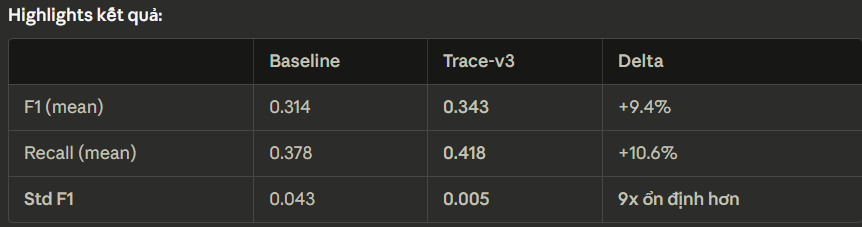

# Experiment Results — MicroSS: Baseline vs Trace-v3

> **Dataset**: MicroSS (micross) — 26,235 train / 13,213 test (11,149 normal + 2,064 anomaly, anomaly rate ~15.6%)
> **Date**: 2026-04-11

---

## 1. Experiment Configuration

| Parameter                          | Value     |
|:-----------------------------------|----------:|
| `dataset`                          |   micross |
| `data_type`                        |      fuse |
| `window_size`                      |        50 |
| `hidden_size`                      |        32 |
| `epoches`                          |   10 / 10 |
| `batch_size`                       |       256 |
| `patience`                         |         5 |
| `alpha` (inter-class distance)     |      0.16 |
| `theta` (difference threshold)     |      0.15 |
| `open_gan_sep`                     |      True |
| `learning_rate`                    |     0.001 |
| `num_runs`                         |         3 |

**Baseline**: `open_trace=False` — log + KPI only  
**Trace-v3**: `open_trace=True`, `num_services=4`, `trace_c=5` — log + KPI + trace (new architecture)

---

## 2. Summary Results

### 2.1 Baseline (log + KPI)

| Run          | Best F1    | Recall     | Precision  | Best Epoch |
|:-------------|-----------:|-----------:|-----------:|-----------:|
| run-0        |     0.3494 |     0.4273 |     0.2956 |          8 |
| run-1        |     0.3394 |     0.4128 |     0.2882 |          9 |
| run-2        |     0.2532 |     0.2951 |     0.2218 |          2 |
| **Mean**     | **0.3140** | **0.3784** | **0.2685** |            |
| **Std**      | **0.0428** | **0.0578** | **0.0325** |            |
| **Max**      | **0.3494** | **0.4273** | **0.2956** |            |

### 2.2 Trace-v3 (log + KPI + trace)

| Run          | Best F1    | Recall     | Precision  | Best Epoch |
|:-------------|-----------:|-----------:|-----------:|-----------:|
| run-0        |     0.3496 |     0.4273 |     0.2958 |          4 |
| run-1        |     0.3386 |     0.4113 |     0.2877 |          6 |
| run-2        |     0.3421 |     0.4167 |     0.2901 |          2 |
| **Mean**     | **0.3434** | **0.4184** | **0.2912** |            |
| **Std**      | **0.0046** | **0.0067** | **0.0034** |            |
| **Max**      | **0.3496** | **0.4273** | **0.2958** |            |

### 2.3 Direct Comparison

| Metric               | Baseline   | Trace-v3   | Delta                          |
|:---------------------|-----------:|-----------:|:-------------------------------|
| **F1 (mean)**        |     0.3140 | **0.3434** | **+0.029 (+9.4%)**             |
| **Recall (mean)**    |     0.3784 | **0.4184** | **+0.040 (+10.6%)**            |
| **Precision (mean)** |     0.2685 | **0.2912** | **+0.023 (+8.5%)**             |
| **F1 (max)**         |     0.3494 | **0.3496** | +0.0002                        |
| **Std F1**           |     0.0428 | **0.0046** | **-0.038 (9x more stable)**    |


---

## 3. F1 Score per Epoch

### Baseline

| Epoch |   Run-0               |   Run-1               |   Run-2                    |
|------:|----------------------:|----------------------:|:---------------------------|
|     0 |                 0.092 |                 0.065 | 0.053                      |
|     1 |                 0.297 |                 0.251 | 0.060                      |
|     2 |                 0.339 |                 0.336 | **0.253** ← best           |
|     3 |                 0.312 |                 0.314 | 0.199                      |
|     4 |                 0.314 |                 0.318 | 0.190                      |
|     5 |                 0.335 |                 0.314 | 0.181                      |
|     6 |                 0.342 |                 0.338 | 0.182                      |
|     7 |                 0.346 |                 0.332 | 0.211 ← early stop         |
|     8 | **0.349** ← best      |                 0.339 |                            |
|     9 |                 0.346 | **0.339** ← best      |                            |

### Trace-v3

| Epoch |   Run-0               |   Run-1               |   Run-2                    |
|------:|----------------------:|----------------------:|:---------------------------|
|     0 |                 0.065 |                 0.308 | 0.318                      |
|     1 |                 0.299 |                 0.276 | 0.311                      |
|     2 |                 0.308 |                 0.306 | **0.342** ← best           |
|     3 |                 0.338 |                 0.300 | 0.339                      |
|     4 | **0.350** ← best      |                 0.323 | 0.339                      |
|     5 |                 0.346 |                 0.331 | 0.331                      |
|     6 |                 0.281 | **0.339** ← best      | 0.326                      |
|     7 |                 0.338 |                 0.325 | 0.338 ← early stop         |
|     8 |                 0.349 |                 0.333 |                            |
|     9 |                 0.346 |                 0.337 |                            |

---

## 4. Runtime

| Job                  | Duration                     |
|:---------------------|:-----------------------------|
| Baseline 3 runs      | ~1h 41m (06:40 → 08:21)      |
| Trace-v3 3 runs      | ~3h 20m (08:25 → 11:45)      |
| **Total**            | **~5h 05m**                  |

> Trace is ~2x slower due to the overhead of TraceEncoder (GAT) and TraceModel on each batch.

---

## 5. Discussion

### 5.1 Main Improvement: Stability, Not Absolute Score

- Mean F1 increased **+9.4%** — practically significant
- **More importantly**: Std F1 dropped from 0.043 to 0.005 (**9x more stable**)
  - Baseline run-2 collapsed (F1=0.253, peaked very early at epoch 2 then declined)
  - Trace-v3 does not exhibit this — all 3 runs converge consistently and stably

### 5.2 Why Doesn't Trace Improve More?

1. **Anomalies are primarily resource-based**: MicroSS injects failures such as CPU spikes and memory leaks — these show up clearly in KPI/log but **do not change the topology** of the call graph (service A still calls B normally even when A is overloaded)
2. **Binary adjacency loses information**: `trace_adj[i,j] ∈ {0,1}` — loses call frequency, latency, and error rate per edge. The Structure AE learns topology but not "A keeps calling B with timeouts"
3. **trace_c=5 may overlap with KPI**: 5 node features per service may already be covered by the 85 KPI metrics
4. **Learnable alpha converges low on its own**: Because the trace signal is weak, gradient pushes `trace_alpha` down → trace contributes little to the anomaly score

### 5.3 Potential Improvements

- Use **weighted adjacency** (response time per edge) instead of binary
- Add **call latency / error rate** to `trace_node_features`
- Trace is better suited for **root cause localization** than binary anomaly detection

---

## 6. Trace-v3 Architecture (5 Changes from Previous Version)

| #   | Change                | Description                                                                                    |
|:---:|:----------------------|:-----------------------------------------------------------------------------------------------|
|  1  | Self-Attention        | Log+KPI only → fused_modal [B,W,2H], trace separated → ZV                                     |
|  2  | Decoder input         | cat([fused_modal, ZV]) → 3H (ZV injected into decoder, inspired by TraceDAE Eq.10)            |
|  3  | adj_hat return        | MultiModel returns adj_hat [B,W,N,N] for use by the Discriminator                             |
|  4  | Learnable alpha       | `trace_alpha = nn.Parameter(-2.2)`, sigmoid(-2.2) ≈ 0.10                                      |
|  5  | Discriminator FAKE    | FAKE pass uses adj_hat instead of trace_adj (fixes contradictory gradient bug)                 |

---

## 7. Run Commands

```bash
# Baseline (log + metric)
python codes/run.py \
    --data "C:/Users/us/Desktop/UAC-AD/.claude/worktrees/data/micross" \
    --dataset micross --data_type fuse \
    --open_trace False \
    --epoches 10 10 --batch_size 256 --patience 5 \
    --alpha 0.16 --open_gan_sep True --run_start 0 --run_end 3 \
    --result_dir "C:/Users/us/Desktop/UAC-AD/.claude/worktrees/data/result_fuse_baseline"

# Trace-v3 (log + metric + trace)
python codes/run.py \
    --data "C:/Users/us/Desktop/UAC-AD/.claude/worktrees/data/micross" \
    --dataset micross --data_type fuse \
    --open_trace True --num_services 4 --trace_c 5 \
    --epoches 10 10 --batch_size 256 --patience 5 \
    --alpha 0.16 --open_gan_sep True --run_start 0 --run_end 3 \
    --result_dir "C:/Users/us/Desktop/UAC-AD/.claude/worktrees/data/result_fuse_trace"
```
